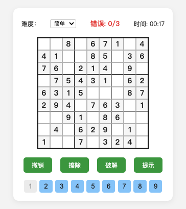

 # Sudoku 数独游戏
 

本项目是一个运行于浏览器端的数独游戏，支持随机生成、难度切换、计时、错误计数、数字输入、撤销、擦除、破解、提示等功能，界面美观，交互友好。

## 页面与配色参考
- 游戏页面布局参考了知名数独应用“天天数独”的设计风格，简洁直观，易于操作。
- 颜色搭配参考了 [flomo 笔记](https://flomoapp.com/) 官方页面的配色方案，整体风格清新舒适。

## 代码与思路参考
- 数独生成与求解的核心算法思路参考了 [MicrosoftEdge/Sudoku](https://github.com/MicrosoftEdge/Sudoku) 项目中的相关实现。
- 代码结构和交互逻辑结合了现代前端开发的最佳实践，保证了良好的可维护性和扩展性。

## 自动化开发说明
本项目在 [Cursor](https://www.cursor.so/) 智能编程助手的协助下自动完成，包括页面结构、样式、核心逻辑、细节优化等，极大提升了开发效率。

---

欢迎体验和提出建议！
